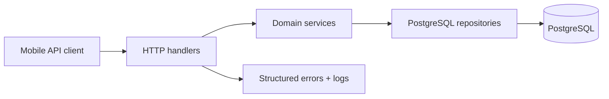

# Architecture

## Context

The Hive is a single mobile client with a compact but stateful API. The architecture favors explicit domain code and strong database constraints over framework-heavy abstractions.

## Mobile application

The Expo application is organized by feature while shared visual primitives stay in `src/components`. Authentication is application-wide state. Form and transient interaction state remain local. TanStack Query owns remote state and cancellation. An opaque bearer token is persisted with Secure Store on native devices and kept in memory on web development builds.

Navigation has three boundaries:

- authentication stack;
- the three-tab main application;
- full-screen planning and workout-execution routes above the tabs.

The theme centralizes the legacy palette (`#141414`, `#171717`, `#DC143C`), spacing, radii, typography and touch sizes. Deliberate design values remain fixed; page structure uses safe areas, flex layout, scroll containers and width constraints.

## Backend application

The backend is one Go process using `net/http`, `log/slog`, PostgreSQL through pgx’s `database/sql` adapter, and narrowly scoped packages:

Handlers own transport parsing and response codes. Services own multi-step rules and transactions. Repositories own SQL and row mapping. Interfaces exist only at service persistence boundaries used by tests.

## Authentication decision

Passwords are hashed with bcrypt. Login and registration issue high-entropy opaque session tokens; only a SHA-256 digest is stored in PostgreSQL. Sessions expire, can be revoked individually on logout, and are checked by middleware. This avoids custom JWT key rotation and makes revocation immediate. The trade-off is one indexed database lookup per authenticated request, which is appropriate for this application’s scale.

## Assignment snapshots

Assigning a workout creates an assignment and set rows in one transaction. The workout name and Roman-numeral position, plus exercise names, order, target reps, and target weight, are copied into the assignment snapshot. Later template edits or reordering do not alter already planned or partially completed workouts. Deleting a template leaves historical assignments intact by setting only their source workout reference to null.

## PostgreSQL design

- UUID primary keys generated by the application.
- Case-insensitive per-user workout-name uniqueness through a functional index.
- Ordered exercises and sets with uniqueness constraints.
- One assignment per user/date.
- `ON DELETE CASCADE` for user-owned live data and assignment children.
- `ON DELETE SET NULL` from assignments to source templates to retain history.
- Indexed token digests, workout ownership/order, and user/date access paths.
- UTC timestamps and a date-only assignment key.

Migrations are embedded in the migration command and run in deterministic filename order. Applied migration checksums are recorded; a changed applied migration fails loudly.

## Error and observability model

Every response includes a request ID header. Expected failures map to stable public codes such as `validation_failed`, `unauthorized`, `not_found` and `conflict`. Unexpected errors are logged with request context and returned as a generic `internal_error`; raw SQL errors never cross the API boundary.

The server uses header/read/write/idle timeouts, body limits, panic recovery, readiness checks and graceful shutdown. Logs are JSON in production and text locally.

## Docker decision

Compose is the reproducible onboarding path:

- `frontend`: Node/Expo development server with the project mounted for fast refresh;
- `backend`: Go development image running the API;
- `postgres`: persistent PostgreSQL with a readiness health check.

The backend production Docker target is a statically compiled binary in a minimal non-root runtime image. Compose waits on database health and the backend still retries startup because ordering alone is not readiness.

React Native simulators run on the host. The frontend container exposes Metro; physical devices need a LAN-reachable Expo host and cannot use Compose-internal service names. These limitations are documented rather than hidden.

## Alternatives considered

- Firebase was rejected because the requested Go/PostgreSQL backend should own validation, persistence and public API behavior.
- A large ORM was rejected; explicit SQL keeps query behavior and transactions visible.
- JWTs were rejected in favor of immediately revocable opaque sessions.
- Redux was rejected because application-global client state is limited to authentication; query and local state cover the remaining needs.
- Generated OpenAPI clients were deferred. The hand-written typed client is small, and CI validates both ends independently.
