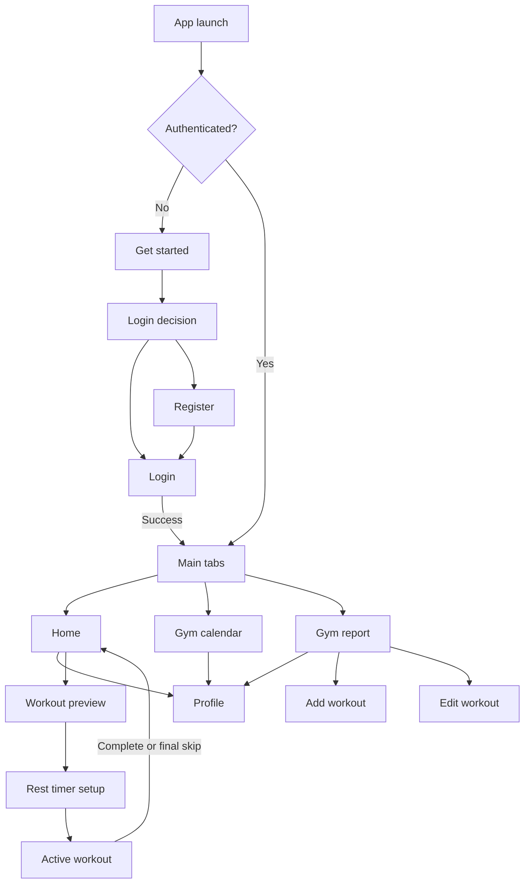

# Legacy application discovery

This document records the source audit completed before the rewrite. The legacy application is a design and behavior reference only.

## Screen inventory

| Area | Screen | Purpose and key states |
| --- | --- | --- |
| Onboarding | Get started | Full-width monochrome gym collage, THE HIVE wordmark, product statement, primary CTA. |
| Onboarding | Login decision | Same hero composition with Login and Register choices. |
| Authentication | Login | Email/password form, social-provider visual placeholders, validation and authentication failures, registration link. |
| Authentication | Register | First name, surname, email and password form; social-provider visual placeholders; success and validation feedback. |
| Main | Home dashboard | User greeting, one-week strip, today's assigned activity, completed exercise/repetition counts and total weight pushed. Empty days appear as Rest. |
| Main | Gym calendar | Month navigation, Monday-first calendar grid, assignment/completion/skipped indicators, workout selection for a chosen future date. |
| Main | Gym report | Ordered workout list, swipe-to-delete, edit action and add-workout CTA. This is a workout-template manager rather than a report. |
| Profile | Profile | Avatar, user name, back action and logout. |
| Workout planning | Add workout | Workout name plus a reorder-stable exercise list with name, sets, reps and weight; swipe-to-delete exercises. |
| Workout planning | Edit workout | Same form populated from an existing workout. |
| Workout execution | Workout preview | Today's workout name, exercise count/list and Next CTA. Rest assignments show a centered recovery message. |
| Workout execution | Rest timer setup | Workout heading, minute/second wheel pickers and Start CTA. |
| Workout execution | Active workout | Exercise/set progress, prominent weight input, horizontal 1-16 rep selector, Skip/Next/Complete actions, fade transition and circular rest countdown with Skip. |

The legacy stack also declares a `RestDay` route that renders a component directly, but no interaction navigates to it. It is retained as a state inside workout preview instead of a standalone route.

## Feature inventory

- Email/password registration, login, session restoration and logout.
- User profile display with a fallback avatar.
- Ordered workout-template CRUD.
- Exercises with name, set count, target repetitions and target weight.
- Monday-first monthly calendar navigation.
- Assigning one workout to a non-past date and unassigning it by selecting the assigned workout again.
- Assignment snapshots so a scheduled workout can track set-level completion independently.
- Home statistics for exercises, repetitions and total volume (`weight x repetitions`).
- Workout preview before execution.
- Configurable rest duration from 0:00 through 5:59.
- Set execution with actual weight/repetitions, skip, rest countdown and final completion.
- Visual status for scheduled, completed and missed calendar assignments.
- Real-time-like refresh behavior after mutations (implemented in the rewrite with query invalidation/refetch rather than database-specific subscriptions).

## Navigation map



Authentication, main tabs and modal/detail flows are separate typed navigators. Add/edit, preview, timer and active-workout screens are presented above the tab navigator.

## Reusable visual components

- `Screen`: safe-area-aware dark page with optional scrolling and keyboard avoidance.
- `BrandLockup`: red THE label paired with the large white HIVE wordmark.
- `OnboardingHero`: retained monochrome collage with responsive crop.
- `Header`: “Hey,” greeting, muted full name and circular avatar.
- `PrimaryButton` and `SecondaryButton`: 69 px target height, 8 px radius, uppercase heavy label.
- `BackButton`: diagonal arrow mark with optional Back label.
- `WorkoutNumber`: crimson rounded square with Roman numeral.
- `WorkoutRow`: ordered workout identity plus trailing action/radio control.
- `StatCard`: square, near-black bordered dashboard tile.
- `WeekStrip` and `MonthCalendar`.
- `BottomTabBar`: centered 184 x 72 pill with three custom line icons and a 54 px selected halo.
- `ExerciseEditorCard`: exercise name and three numeric fields.
- `StateMessage`: design-compatible loading, empty and error treatment.
- `RestCountdown`: crimson circular progress and large remaining-time label.

## Backend and API requirements

- Secure registration/login/logout and session lookup.
- Current-user profile.
- Per-user ordered workout CRUD with nested exercises and duplicate-name protection.
- Date-range assignment reads.
- Atomic assign/unassign operations that snapshot exercises and their sets.
- Atomic set-result updates and assignment finalization.
- Today dashboard aggregate returned by the server so calculations are not duplicated across clients.
- Consistent `{ data }` success and `{ error: { code, message, fields? } }` failure envelopes.
- PostgreSQL migrations, constraints, indexes, transactions and parameterized queries.
- Request IDs, structured logs, timeouts, graceful shutdown and safe errors.
- Health/readiness endpoints for Docker and deployment checks.

The concrete contract lives in `docs/openapi.yaml`.

## Asset inventory

| Legacy asset | Decision | Reason |
| --- | --- | --- |
| `Group 47.png` | Retain as `onboarding-collage.png` | Central to onboarding design. The owner explicitly approved reuse; redistribution rights must still be confirmed before public release. |
| `default-profile.png` | Replace with code-native avatar silhouette | The geometry is trivial and avoids retaining an unattributed bitmap. |
| Expo icon/splash/adaptive icon placeholders | Replace with a project-specific code-generated brand asset before store release | Current files are generic template artifacts. |
| React logos and partial React logo | Remove | Unused template artifacts. |
| Space Mono font | Remove | Present but never loaded or used. |
| Inline SVG paths | Retain as typed code-native icon components | They define the visual identity and need no icon library. |

## Dependency audit

| Legacy dependency | Rewrite decision |
| --- | --- |
| Expo / React / React Native | Keep, upgraded as one compatible Expo SDK set. |
| React Navigation native, stack and bottom tabs | Keep native + bottom tabs; use native-stack and typed route definitions. |
| Safe Area Context / Screens / Gesture Handler | Keep; required for safe areas, navigation and swipe interactions. |
| React Native SVG | Keep for the existing custom icon language and countdown ring. |
| Picker | Keep for the native rest-time wheel interaction. |
| Firebase | Remove; Go/PostgreSQL becomes the only application backend. |
| Countdown Circle Timer | Remove; a small local component is sufficient. |
| Reanimated | Remove unless pulled transitively by a retained native dependency; core Animated covers the single fade. |
| React DOM / React Native Web / Metro runtime | Keep only as Expo-managed web-development dependencies. |
| TanStack Query | Add for server-state lifecycle, cancellation, retries and focused invalidation. |
| Expo Secure Store | Add for the opaque session token on device. |
| Jest / Testing Library | Keep/add for logic, hooks and focused component integration tests. |

## Proposed monorepo architecture

```text
.
├── apps/mobile/              # Expo React Native + TypeScript
│   ├── src/api/              # HTTP client, errors and typed models
│   ├── src/auth/             # Session state and secure token storage
│   ├── src/components/       # Design-system and feature components
│   ├── src/features/         # Domain-oriented screens/hooks
│   ├── src/navigation/       # Typed auth/app/modal navigators
│   └── src/theme/            # Design tokens
├── backend/
│   ├── cmd/api/              # API process
│   ├── cmd/migrate/          # Deterministic migration runner
│   ├── internal/             # auth, domain, HTTP and PostgreSQL code
│   └── migrations/           # Ordered SQL migrations
├── docs/                     # Audit, architecture and OpenAPI contract
├── bin/                      # Small Docker Compose entry points
├── scripts/                  # Repository checks
├── .github/workflows/        # CI
└── docker-compose.yml
```

There is deliberately no shared generated-code package yet. The OpenAPI document is the contract; adding code generation would create more machinery than this repository needs.

## Implementation order

1. Freeze the visual/behavior inventory and API contract.
2. Establish root tooling, environment examples and Compose services.
3. Implement migrations and PostgreSQL repositories.
4. Implement authentication and session middleware.
5. Implement workout CRUD and assignment transactions.
6. Implement dashboard aggregates and handler tests.
7. Establish the mobile theme, API client, auth boundary and typed navigation.
8. Rebuild onboarding/auth/profile.
9. Rebuild workout CRUD and monthly scheduling.
10. Rebuild dashboard, workout preview, timer and set execution.
11. Add loading/empty/error/offline states, responsive tests and accessibility metadata.
12. Run repository hygiene, Docker, backend and frontend verification; finish public documentation.

## Ambiguities and inconsistencies resolved

- The old “Gym Report” screen is a template manager. The visible label remains unchanged for parity; internal names use `WorkoutLibrary`.
- Workout IDs were Roman numerals and edit code sometimes addressed documents by workout name. The rewrite uses UUIDs; Roman numerals are display-only stable ordering.
- Deleting a workout compared assignment objects to a string ID and therefore did not reliably detach assignments. PostgreSQL foreign keys and an explicit transactional delete resolve this.
- `setCount` held the number of exercises, not sets. It is removed; counts are derived.
- Editing a template could mutate or fail to find the wrong Firebase document. Updates now use immutable UUIDs.
- The old registration flow created an authenticated user, then navigated to login while the auth observer could navigate home. Registration now returns a session and enters the app consistently.
- Social-login icons had no behavior. They are omitted until a provider is actually configured; no dead controls are presented.
- Past calendar days could still be selected even though assignment later failed silently. Past dates remain inspectable but assignment controls are disabled with feedback.
- Assignment set arrays were created with `Array.fill` using a shared object reference. Relational rows remove that aliasing issue.
- Completion semantics were inconsistent when sets were skipped. The rewrite records each set as pending/completed/skipped and considers an assignment completed only when explicitly finalized with no pending sets.
- Home subscribed again whenever the viewed week changed, although its data was only for today. These concerns are independent in the rewrite.
- The week strip arrows changed the label’s week but individual days were not actionable. This behavior is preserved.
- The old app hard-coded a 493 px dashboard region and `25%` bottom padding. The rewrite preserves proportions with flex/min/max constraints and measured safe-area/tab-bar insets.
- The onboarding collage is approved for reuse by the repository owner, but its original licensing evidence is absent. Public release remains contingent on confirming redistribution rights.
